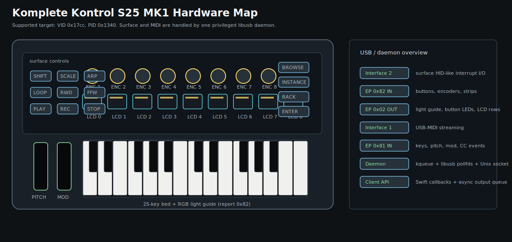
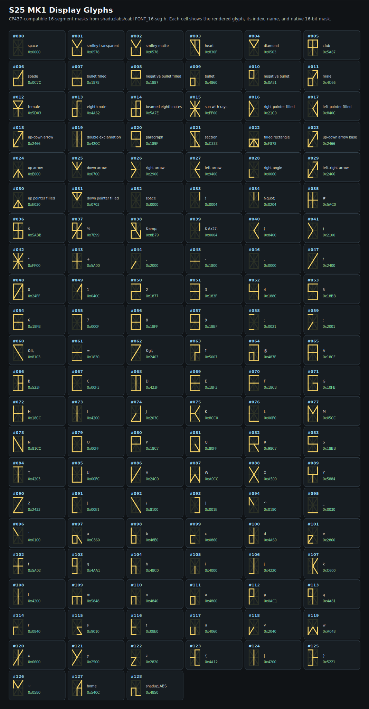
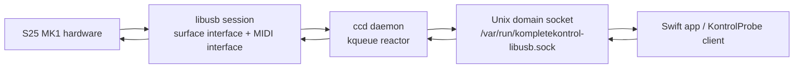

# CompleteControl

Swift control library and diagnostics tools for the Native Instruments Komplete Kontrol S25 MK1.

This project talks to the S25 MK1 as a real hardware surface: RGB light guide, button LEDs, the nine segmented LCDs, buttons, rotary encoders, touch strips, and USB-MIDI input. It is not an official Native Instruments project and is not endorsed by Native Instruments.

The current implementation targets macOS and is optimized around a privileged libusb daemon with a kqueue reactor. The daemon owns the USB interfaces once, handles async libusb transfers, pushes surface and MIDI input to clients over a Unix domain socket, and keeps output writes out of app processes that should not run as root.

## Status

Supported now:

- Native Instruments Komplete Kontrol S25 MK1, observed as `VID 0x17cc`, `PID 0x1340`
- RGB light guide for 25 keys
- Button LED output
- Nine segmented LCD modules
- Surface input: buttons, eight rotary encoders, encoder touch, main encoder, pitch strip, mod strip
- USB-MIDI input through the daemon
- Foreground debug daemon and quiet release daemon
- Idle daemon surface diagnostics while no client is connected
- REPL benchmark and an AppKit demo UI

Not supported yet:

- S49/S61/S88 MK1 verification
- MK2/MK3 protocol families
- Windows/Linux packaging
- Stable semantic-versioned public API
- A final repository license file

## Hardware Overview



| Area | Current mapping |
| --- | --- |
| Device | Native Instruments Komplete Kontrol S25 MK1 |
| USB IDs | Vendor `0x17cc`, product `0x1340` |
| Surface interface | Interface `2`, interrupt IN `0x82`, interrupt OUT `0x02` on tested hardware |
| MIDI interface | Interface `1`, USB-MIDI bulk IN `0x81` on tested hardware |
| Light guide | Report `0x82`, 25 RGB triples |
| Button LEDs | Report `0x80`, button LED value table from the reverse-engineered controller mapping |
| Displays | Report `0xe0`, three row payloads, nine displays, eight 16-segment cells per text row |
| Display row 0 | Progress/bar row only |
| Display rows 1-2 | Text or raw 16-segment glyph masks |
| Input report | Report `0x01`, decoded to button, encoder, touch, and strip events |

## Why This Architecture Exists

The short version: CoreMIDI sees keys, but not the whole surface. HID can see the surface, but direct HID output is not a robust low-latency ownership model for this device on macOS. libusb gives us the right level of control, but it needs privileged interface claiming. That combination forced the daemon architecture.

### Why Not Only CoreMIDI?

CoreMIDI is useful for musical input: keys, note on/off, pitch bend, modulation, and normal MIDI control data. It does not expose the S25 MK1 surface display protocol, light guide reports, button LED reports, rotary encoder reports, or the segmented LCD frame format. A MIDI-only app can be a keyboard app; it cannot be a full S25 surface driver.

This library still provides MIDI events, but the high-performance path reads the USB-MIDI endpoint inside the daemon so MIDI and surface events share one transport, one timestamping model, and one kqueue wakeup path.

### Why Not Only HID?

The S25 MK1 presents HID-like reports, and the library still has IOKit/HID code for fallback and diagnostics. In practice, full output control is fragile when other drivers or services own the device, and direct app-side HID ownership does not solve the privilege and device-claim problem cleanly.

Community projects have run into the same class of problems. qKontrol documents that, on macOS, Native Instruments services may have to be stopped before its direct-access approach can use Komplete Kontrol MK2 hardware. Rebellion takes a different route by talking to NI's own host integration services instead of stopping them. MMK3-HID-Control describes the same general issue for Maschine MK3: NI background components claim the hardware before third-party software can draw to it.

CompleteControl uses a dedicated privileged daemon instead. Apps talk to a local Unix socket; the daemon claims the USB interfaces once and refuses to start if another daemon is already active.

### Why libusb + kqueue?

libusb exposes pollable file descriptors for its asynchronous API on Unix-like systems. The daemon registers those descriptors plus client sockets in a kqueue. When kqueue reports libusb readiness, the daemon pumps libusb non-blockingly and dispatches completed transfers to connected clients.

That gives us:

- no hot loop
- no coarse periodic polling tick in the normal path
- one owner for libusb event handling
- async surface input and async USB-MIDI input
- queued output writes from client apps
- structured debug logging only in debug builds or when explicitly enabled
- quiet release builds for benchmarks and performance-sensitive use

The measured daemon callback to client callback benchmark after this change:

```text
Samples: 100
Surface: 57
MIDI:    43
Combined median: 0.253 ms
Combined P95:    0.529 ms
Combined P99:    0.691 ms
Combined max:    0.713 ms
```

These numbers are from `make daemon-release` plus `make probe-run-release` on the development machine. They measure input delivery inside this library, not acoustic or LED perception latency.

## Related Work And Credits

This project builds on the public reverse-engineering work around Native Instruments controllers.

- [shaduzlabs/cabl](https://github.com/shaduzlabs/cabl) is the major reference point. The display font table in this repository is derived from cabl's `FONT_16-seg.h` table, which is marked MIT licensed in the source comments.
- [qKontrol](https://github.com/GoaSkin/qKontrol) is an open Linux/macOS application for Komplete Kontrol MK2 configuration and direct device access.
- [SynthesiaKontrol](https://github.com/ojacques/SynthesiaKontrol) and [KompleteSynthesia](https://github.com/tillt/KompleteSynthesia) document and exercise the light guide path for Synthesia workflows.
- [LightKontrol](https://github.com/madebycm/LightKontrol) is a lightweight HID-based light guide tool for MK2 controllers.
- [Rebellion](https://github.com/terminar/rebellion) explores the opposite architecture: integrating with NIHA/NIHIA instead of claiming the hardware directly.
- [openAV-Ctlra](https://github.com/openAVproductions/openAV-Ctlra) is a broader C library for hardware controllers, including USB HID devices and several Native Instruments controllers.
- [HIDAPI](https://github.com/libusb/hidapi) and [libusb](https://libusb.info/) are foundational libraries in this space.

## Requirements

- macOS 15.0 or newer
- Swift 6.0 toolchain
- Xcode command line tools
- libusb 1.0

Install libusb with Homebrew:

```bash
brew install libusb
```

Build:

```bash
make build
make build-release
```

## Quick Start

Install the daemon once:

```bash
make install-daemon
```

For hardware and protocol debugging, install the debug daemon instead:

```bash
make install-debug-daemon
```

Run the middleware demo:

```bash
make run
```

Run the old REPL baseline:

```bash
make probe-run
```

Run the old AppKit surface demo:

```bash
make probe-ui
```

Run a quiet release daemon and release client for latency work:

```bash
make daemon-release
make probe-run-release
```

Useful maintenance targets:

```bash
make help
make daemon-status
make daemon-debug
make install-debug-daemon
make daemon-stop
make uninstall-daemon
```

## Using The Swift Library

Add the package to another Swift package:

```swift
dependencies: [
    .package(url: "https://github.com/YOUR-ORG/CompleteControl.git", branch: "main")
]
```

Add the middleware product to your target:

```swift
.product(name: "KontrolSurfaceKit", package: "CompleteControl"),
.product(name: "KompleteKontrol", package: "CompleteControl"), // for shared hardware types such as KKRGB
```

For application code, use `KontrolSurfaceKit`'s SwiftUI-like declarative `Screen`
DSL. The older imperative setters are deprecated for client-facing code and are
kept only as a migration and diagnostics escape hatch. New apps should model a
surface as a value and render it with `present(_:)` or `observe { ... }`.

Declarative surface setup:

```swift
import KontrolSurfaceKit
import KompleteKontrol

struct PatternScreen: Screen {
    var row: Int
    var isPlaying: Bool

    var body: [any ScreenElement] {
        Status(isPlaying ? "PLAY" : "EDIT")
        Cell(1) {
            Bar(Double(row) / 63)
            Label("ROW", overflow: .clip)
            Value(row)
        }
        Cell(2) {
            Label("CH1", overflow: .clip)
            Label("C-4 01", overflow: .clip)
        }
        Lamp(.play, isPlaying ? .on : .on(0x14))
        KeyColors { key in
            key == 12 ? KKRGB(red: 0x00, green: 0x60, blue: 0x7f) : nil
        }
    }
}

let surface = Surface()

Task {
    await surface.start()
    await surface.present(PatternScreen(row: 0, isPlaying: false))
}
```

Inputs are consumed from `surface.inputs`; MIDI is consumed from `surface.midi`.
Prefer attaching behavior inside a `Screen` with `Cell(...).onEncoder`,
`Lamp(...).onTap`, and `MainEncoder` when the behavior belongs to the active
screen.

Connection state is consumed from `surface.connectionStates`. A running app
should treat `.retrying` as non-fatal: keep the normal UI usable, show the state
to the user, and let `Surface` keep probing/reconnecting in the background.

### Deprecated Imperative Driver Path

The current low-level Swift module name is still `KompleteKontrol`, and the raw
driver APIs remain available for diagnostics, protocol work, and legacy tools
such as `KontrolProbe`. Do not build new application workflows around these
imperative setters:

```swift
import KompleteKontrol

let kk = KompleteKontrolS25MK1()
kk.startInputMonitoring()
kk.handshakeAsync()

_ = kk.setKey(0, color: KKRGB(red: 0x7f, green: 0x00, blue: 0x00), flush: false)
_ = kk.setButtonLED(name: "play", value: 0x7f, flush: false)
_ = kk.setDisplayText("FILTER", display: 0, row: 1, alignment: .center, flush: false)
kk.sendGuideAsync()
kk.sendButtonLEDsAsync()
kk.sendDisplaysAsync()
```

## Tools

`KontrolProbe` is the diagnostic executable in `Tools/KontrolProbe`.
`ccd` is the launchd/foreground daemon executable in `Tools/ccd`.

Modes:

- normal REPL client: `make probe-run`
- release REPL client: `make probe-run-release`
- foreground debug daemon: `make daemon-debug` (runs `ccd`)
- quiet release daemon: `make daemon-release` (runs `ccd`)
- AppKit demo UI: `make probe-ui`

Important REPL commands:

```text
demo                 run a self-test
rainbow              rainbow light guide
lcd D R TEXT...      set LCD text; row 0 is not a text row
lcdbar D VALUE       set row-0 progress on one display
button I|NAME V      set a button LED
buttonmap            print button LED names
daemonstatus         show daemon session endpoints
daemonread [MS]      read one queued surface packet
daemonmidi [MS]      read one queued USB-MIDI packet
benchmark [N]        collect N surface/MIDI input latency samples, then print stats
```

The benchmark collects silently in the hot path. It prints combined, surface-only, MIDI-only, and slowest-sample summaries only after the target sample count is reached.

## Demo UI

The AppKit demo UI mirrors the S25 panel and exercises the hardware:

- click keys in the UI to send RGB light guide updates
- click buttons to toggle the matching hardware LEDs
- press hardware buttons to pulse the UI overlay
- turn hardware encoders to update LCD progress/value pairs
- play MIDI notes to light and clear key LEDs
- use display 8 as a glyph test

Glyph-test behavior on the last LCD:

- row 0 remains a progress bar
- row 1 shows an eight-glyph sliding window
- row 2 shows a numeric index such as `000/128`
- encoder 8 moves the window by one glyph per encoder event
- clicking the last LCD also advances by one glyph
- there is no wrap-around; the window clamps at the start and end

## Display Glyphs

The display font is a CP437-compatible 16-segment table derived from cabl. There are 129 entries: codes `0...127` plus the cabl extra glyph at `128`.



The SVG is generated from the same mask values used by `KKDisplayFrame`. For hardware truth, use the demo UI glyph test because the actual LCD module is the final renderer.

## Architecture



Main source files:

| File | Purpose |
| --- | --- |
| `Sources/KompleteKontrol/KompleteKontrol.swift` | Public Swift API, display frame model, input decoding, daemon client, daemon server |
| `Sources/KontrolUSB/KontrolUSB.c` | libusb session, endpoint discovery, async transfers, direct USB diagnostics |
| `Tools/ccd/main.swift` | CompleteControl daemon entry point |
| `Tools/KontrolProbe/main.swift` | REPL, benchmark, diagnostics |
| `Tools/KontrolProbe/TestUI.swift` | AppKit surface demo |
| `install-daemon.sh` | launchd daemon installer |
| `media.vanille.kompletekontrol-libusb.plist` | launchd service definition |

## Daemon Behavior

The daemon:

- refuses to start when another daemon is already active
- creates `/var/run/kompletekontrol-libusb.sock`
- claims the libusb surface interface and USB-MIDI streaming interface
- owns the hardware surface only while no socket client is connected
- shows `NO CLIENT` plus the running revision when idle, and acknowledges surface/MIDI input on the LCDs for rudimentary hardware diagnosis
- lights pressed MIDI keys on the light guide while idle
- briefly shows the active registered client's name/PID, then leaves surface ownership to the client
- returns to `NO CLIENT` only after the last socket disconnects and no client remains registered
- starts async transfers for surface input and MIDI input
- timestamps push messages at daemon callback time
- queues input messages for synchronous `daemonread`/`daemonmidi` diagnostics
- keeps debug logging out of release hot paths unless explicitly enabled

Set `KK_DAEMON_DISABLE_SURFACE=1` when you want the daemon to stay completely silent on the
hardware surface even while idle.

The revision shown by the idle diagnostic is embedded into the binary at SwiftPM build time by
the `GenerateBuildInfo` build-tool plugin. It records `git rev-list --count HEAD` and the short
hash from the checkout used for the build. A `+` after the revision count means the binary was
built from a dirty checkout.

Debug logging is structured on stderr:

```text
timestamp=2026-06-25T10:06:01.734Z group=usb-midi level=INFO message=...
```

Use:

```bash
make daemon-debug
```

or install the debug launchd daemon:

```bash
make install-debug-daemon
```

Release benchmarking should use:

```bash
make daemon-release
```

## Development Notes

Useful checks:

```bash
swift build --product ccd
swift build --product KontrolProbe
swift build -c release --product ccd
swift build -c release --product KontrolProbe
swift test
git diff --check
```

`swift test` currently includes focused decoder coverage for the S25 input report path.

The current installer installs the built `ccd` executable to `/usr/local/bin/ccd` and loads a launchd service under `/Library/LaunchDaemons`. If you are packaging this for users, review the installer, code signing, and notarization before release.

## Safety And Compatibility

This software claims USB interfaces and writes directly to controller LEDs/displays. Use it only with hardware you can reset or power-cycle. If the official Native Instruments software or background services are active, expect ownership conflicts unless the daemon has successfully claimed the needed interfaces.

Only one libusb daemon should run at a time. The daemon and Makefile preflight checks intentionally refuse duplicate or stale daemon states.

## License

CompleteControl is released under the MIT License. See [LICENSE](LICENSE).

The 16-segment glyph table is derived from shaduzlabs/cabl's `FONT_16-seg.h`, whose source comments identify it as MIT licensed.
